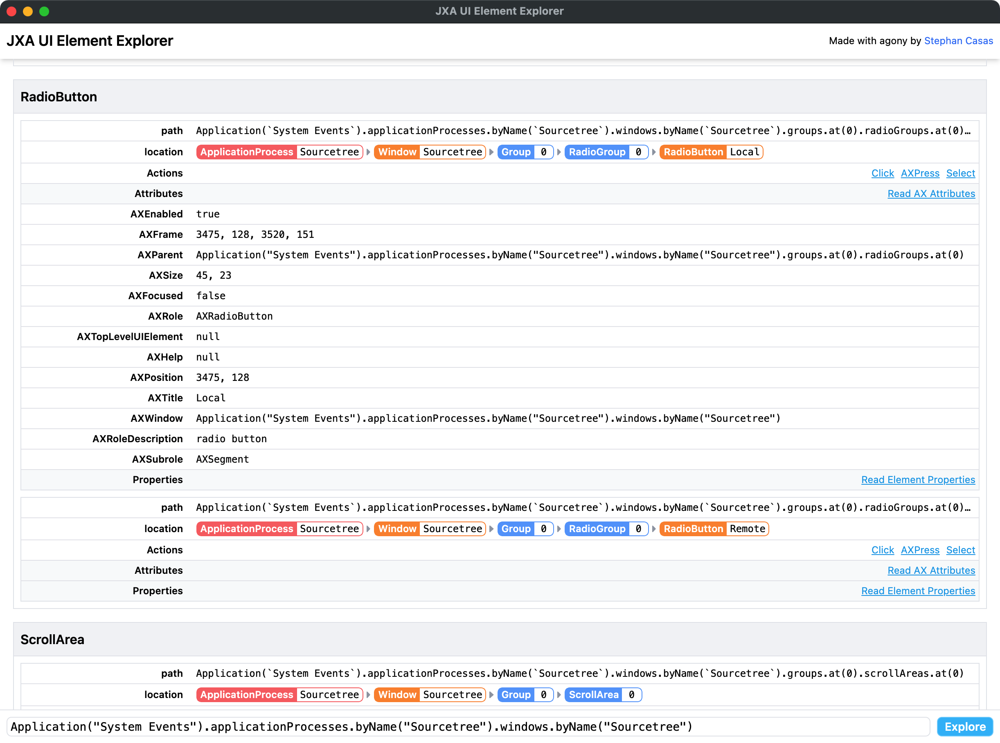

# JXA UI Elements Explorer

*JXA UI Elements Explorer* offers you GUI-driven resolution of `UI Element` paths for the JXA (osascript) language — making it easy to find scriptable UI elements for the purposes of writing robust automation workflows.

## Screenshot

## Preview

This readme is a preview/placeholder for a work-in-progress app. If interesteed, please be patient.